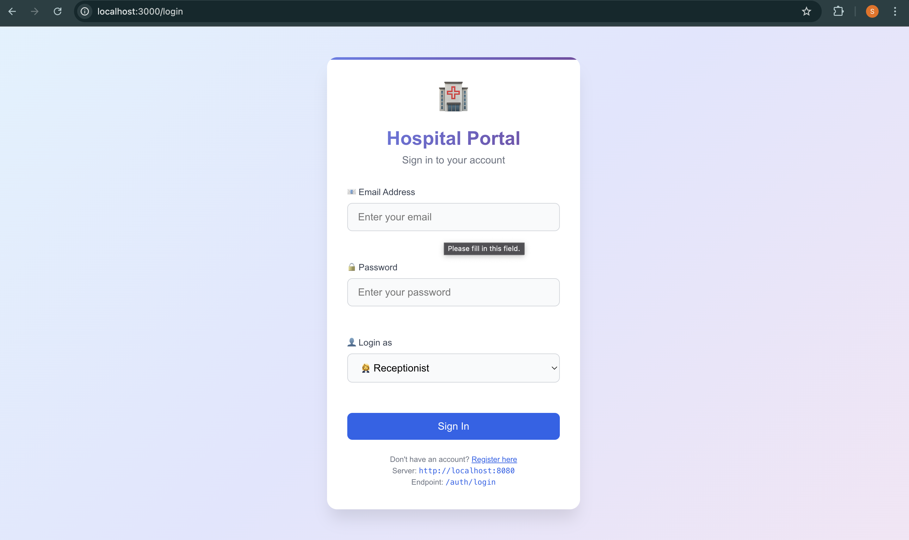
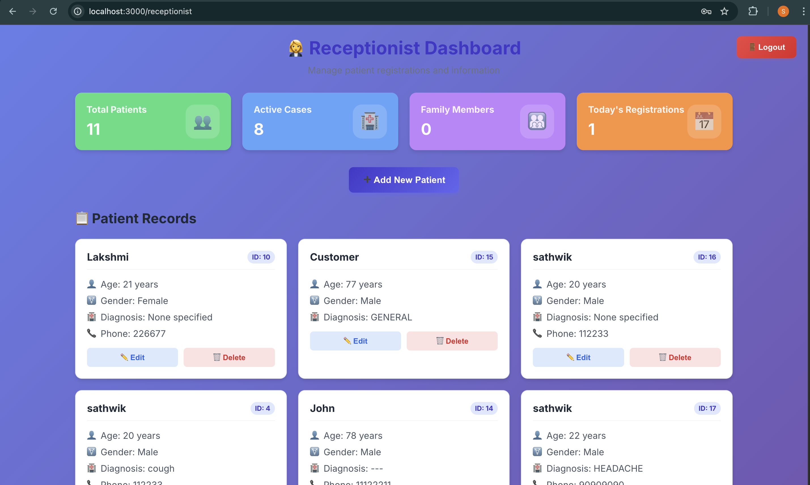
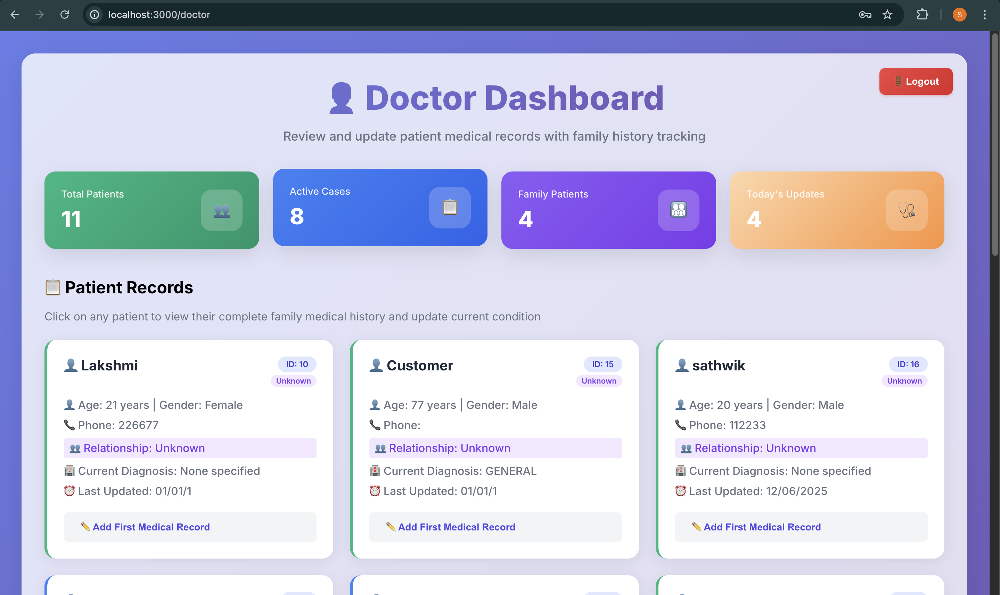

<<<<<<< HEAD
# hospital-portal
=======
# Hospital Portal

Backend Golang app for doctors & receptionists


# 🏥 Hospital Portal

A full-stack web application built with **Go (Golang)** for the backend and **React.js** for the frontend. It features a **Receptionist** and **Doctor** portal with proper authentication and PostgreSQL integration.

---

## ✨ Features

### 🔐 Auth System
- Single login page for both Receptionist and Doctor.
- JWT-based session management.

### 🧑‍💼 Receptionist Portal
- Register new patients.
- View, update, and delete patient records (CRUD).

### 🩺 Doctor Portal
- View patient data.
- Update patient diagnosis and treatment details.

---

## 🛠 Tech Stack

| Layer       | Technology             |
|-------------|------------------------|
| Backend     | Go (Gin framework)     |
| Database    | PostgreSQL (via GORM)  |
| Frontend    | React.js               |
| API Testing | Postman (optional)     |
| Docs        | Swagger / Postman      |

---

## 🗂 Directory Structure

```

hospital-portal/
├── cmd/
│   └── main.go                  # Entry point for backend
├── config/
│   └── database.go              # PostgreSQL connection
├── controllers/
│   ├── auth.go                  # Auth logic
│   └── patient.go               # Patient CRUD logic
├── models/
│   └── user.go, patient.go      # GORM models
├── frontend/
│   ├── src/
│   │   ├── components/          # Reusable React components
│   │   └── pages/               # Dashboards & Auth pages
│   └── public/
├── go.mod
└── README.md                    # You're reading this!

````

---

## ⚙️ Setup Instructions

### 1. Clone the repository
```bash
git clone https://github.com/your-username/hospital-portal.git
cd hospital-portal
````

### 2. Backend Setup (Go)

#### ✅ Prerequisites:

* Go installed (v1.18+)
* PostgreSQL running
* Create a PostgreSQL database named `hospitaldb`

#### 🔧 Update DB Config:

In `config/database.go`, update this line:

```go
dsn := "host=localhost user=YOUR_USERNAME password=YOUR_PASSWORD dbname=hospitaldb port=5432 sslmode=disable TimeZone=Asia/Kolkata"
```

#### ▶️ Run the backend:

```bash
go run ./cmd/main.go
```

---

### 3. Frontend Setup (React)

```bash
cd frontend
npm install
npm start
```

Your app will now run at `http://localhost:3000`.

---

## 🧪 API Documentation

You can import the included Postman collection or Swagger file from the `docs/` folder.

---

## ✅ Functional Summary

| Role         | Abilities                                   |
| ------------ | ------------------------------------------- |
| Receptionist | Register, update, delete, and view patients |
| Doctor       | View and update patient data                |


---

## 🚀 Deployment

(Not mandatory, but optional)

* Can be deployed using Render, Railway, Vercel (frontend), or Docker

---

## 🧾 License

This project is for educational and assessment purposes.

---

## 🙌 Author

**Sathwik Katla**
[GitHub](https://github.com/Sathwik-145)

---

```

---

### ✅ What You Should Do Now:

1. Replace:
   - `YOUR_USERNAME` with your PostgreSQL username
   - `YOUR_PASSWORD` with your DB password


   
   
   
>>>>>>> 82eda99f (Initial commit)

